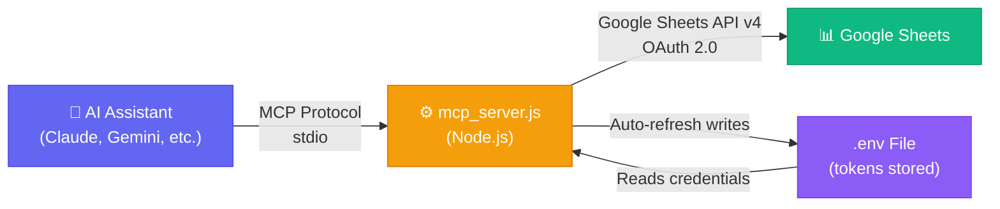
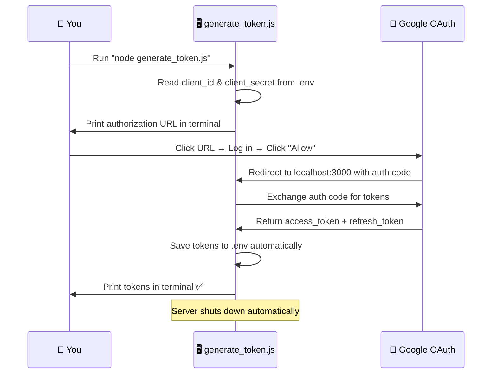
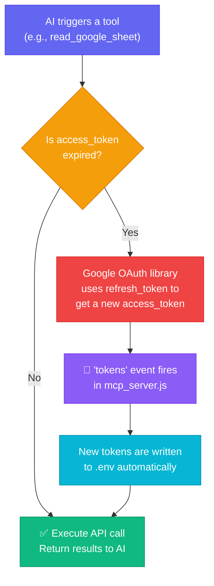

# 📊 Google Sheets MCP Server

A powerful **Model Context Protocol (MCP)** server that connects any AI assistant to Google Sheets. Read, write, format, and manage your spreadsheets using natural language — no manual API calls, no code changes, no token headaches.

> **Built with Node.js** · Uses Google Sheets API v4 · OAuth 2.0 with automatic token refresh

---

## ✨ Features

| Feature | Description |
|---|---|
| 📖 **Read Data** | Read any range of cells from any sheet tab |
| ✏️ **Write Data** | Insert or update rows using A1 notation |
| 🎨 **Format Cells** | Apply font families across any cell range |
| 📋 **Dropdown Validation** | Add data validation dropdowns to columns |
| 🗑️ **Remove Validation** | Remove dropdown rules from columns |
| ➕ **Create Tabs** | Create new sheet tabs inside your spreadsheet |
| 🔄 **Auto Token Refresh** | Access tokens refresh automatically — zero manual work |

---

## 🏛️ Architecture Overview



**How it works:** Your AI assistant communicates with `mcp_server.js` via the MCP protocol over stdio. The server authenticates with Google using OAuth 2.0 credentials from your `.env` file and executes operations on your Google Sheet. When tokens expire, they are refreshed automatically and saved back to `.env`.

---

## 📁 Project Structure

```
MCP_GOOGLE_SHEET/
├── mcp_server.js          # Main MCP server — registers tools & handles requests
├── generate_token.js      # One-time OAuth helper — generates initial tokens
├── .env                   # Your credentials & tokens (never committed to git)
├── .env.example           # Template for new users
├── .gitignore             # Ensures .env stays private
├── package.json           # Node.js dependencies
└── README.md              # This file
```

---

## 🚀 Quick Start

### Prerequisites

- **Node.js** v18 or higher
- A **Google Cloud** account
- A **Google Sheet** you want to control

---

### Step 1: Clone & Install

```bash
git clone https://github.com/Eswarkanakaraj/MCP_GOOGLE_SHEET.git
cd MCP_GOOGLE_SHEET
npm install
```

---

### Step 2: Google Cloud Setup

You need to create OAuth 2.0 credentials in the Google Cloud Console so the server can access your Google Sheets.

#### 2.1 — Create a Google Cloud Project

1. Go to the [Google Cloud Console](https://console.cloud.google.com/).
2. Click **Select a Project** → **New Project**.
3. Name it (e.g., `MCP Sheet Sync`) and click **Create**.

#### 2.2 — Enable the Google Sheets API

1. In your new project, navigate to **APIs & Services → Library**.
2. Search for **Google Sheets API**.
3. Click **Enable**.

#### 2.3 — Configure OAuth Consent Screen

1. Go to **APIs & Services → OAuth Consent Screen**.
2. Select **External** and click **Create**.
3. Fill in the required fields:
   - **App Name**: `MCP Sheet Sync`
   - **User Support Email**: Your email
4. Under **Scopes**, click **Add or Remove Scopes** and add:
   ```
   https://www.googleapis.com/auth/spreadsheets
   ```
5. Under **Test Users**, add your own Google email.
6. Click **Save and Continue**.

> **💡 Important:** If you want tokens that never expire, click **PUBLISH APP** on the OAuth Consent Screen to move from "Testing" to "In Production". In Testing mode, refresh tokens expire after 7 days.

#### 2.4 — Create OAuth Client Credentials

1. Go to **APIs & Services → Credentials**.
2. Click **Create Credentials → OAuth client ID**.
3. Application Type: **Web application**.
4. Name: `MCP Sheet Sync Client`.
5. Under **Authorized redirect URIs**, add:
   ```
   http://localhost:3000/oauth2callback
   ```
6. Click **Create**.
7. Copy your **Client ID** and **Client Secret**.

---

### Step 3: Configure `.env`

Create a `.env` file in the project root with your credentials:

```env
client_id=YOUR_CLIENT_ID.apps.googleusercontent.com
client_secret=YOUR_CLIENT_SECRET
sheet_id=YOUR_GOOGLE_SHEET_ID
```

> **💡 How to find your Sheet ID:** Open your Google Sheet in the browser. The URL looks like:
> `https://docs.google.com/spreadsheets/d/`**`1gCZhHSR-WcofTcaf9nbNYLURRmuEGXnj4BzDulHjWAs`**`/edit`
> The bold part is your `sheet_id`.
---

### Step 4: Generate Your Tokens (One-Time Setup)

Run the token generator script:

```bash
node generate_token.js
```

**What happens:**



1. The script prints a URL in your terminal.
2. Click the URL (or copy-paste into your browser).
3. Log in with your Google account and click **"Allow"**.
4. The script automatically catches the callback, fetches your tokens, saves them to `.env`, and prints them in the console.
5. **Done!** You never need to run this script again (unless you revoke access).

After running, your `.env` will look like this:

```env
client_id=452139...apps.googleusercontent.com
client_secret=GOCSPX-...
sheet_id=1gCZhHSR-...
refresh_token=1//0gzqB9...
access_token=ya29.a0AQvPy...
```

---

### Step 5: Register the MCP Server

Add the server to your AI assistant's MCP configuration file.

#### For Claude Desktop

Edit `claude_desktop_config.json`:

```json
{
  "mcpServers": {
    "GoogleSheetsSync": {
      "command": "node",
      "args": [
        "C:/path/to/MCP_GOOGLE_SHEET/mcp_server.js"
      ]
    }
  }
}
```

#### For Gemini / Antigravity IDE

Edit `mcp_config.json`:

```json
{
  "mcpServers": {
    "GoogleSheetsSync": {
      "command": "node",
      "args": [
        "D:/path/to/MCP_GOOGLE_SHEET/mcp_server.js"
      ]
    }
  }
}
```

> **📌 Note:** Replace the path with the actual absolute path to `mcp_server.js` on your machine.

---

## 🔄 How Automatic Token Refresh Works

This is the key feature that makes this server zero-maintenance after the initial setup.



### What this means for you:

| Scenario | What happens | Action required |
|---|---|---|
| Access token expires (every ~1 hour) | Server silently refreshes it using `refresh_token` and saves the new token to `.env` | **None** ✅ |
| Refresh token is valid | Google issues a new access token whenever needed | **None** ✅ |
| App is published in Google Cloud | Refresh token **never expires** | **None** ✅ |
| App is in Testing mode | Refresh token expires after 7 days | Re-run `node generate_token.js` |
| You revoke access from Google Account | All tokens become invalid | Re-run `node generate_token.js` |

---

## 🧰 Available MCP Tools

### 1. `read_google_sheet`

Reads cell values from any range in the spreadsheet.

| Parameter | Type | Required | Description |
|---|---|---|---|
| `range` | string | ✅ | A1 notation (e.g., `'Sheet1!A1:Z100'`) |

**Example prompt:**
> *"Read all data from Sheet1, rows 1 to 50."*

---

### 2. `update_google_sheet`

Writes values to a specific range in the spreadsheet.

| Parameter | Type | Required | Description |
|---|---|---|---|
| `range` | string | ✅ | A1 notation (e.g., `'Sheet1!A2:C2'`) |
| `values` | string[] | ✅ | Array of values (e.g., `['Task 1', 'Done', '2026-05-23']`) |

**Example prompt:**
> *"Add a new row: Task ID 101, Module 'Auth', Status 'In Progress' to Sheet1 row 15."*

---

### 3. `format_google_sheet`

Applies font formatting across a range of cells.

| Parameter | Type | Required | Default | Description |
|---|---|---|---|---|
| `fontFamily` | string | ✅ | — | Font name (e.g., `'Inter'`, `'Roboto'`) |
| `sheetId` | integer | ❌ | `0` | Sheet tab ID |
| `startRowIndex` | integer | ❌ | `0` | Start row (0-based) |
| `endRowIndex` | integer | ❌ | `1000` | End row (exclusive) |
| `startColumnIndex` | integer | ❌ | `0` | Start column (0-based) |
| `endColumnIndex` | integer | ❌ | `26` | End column (exclusive) |

**Example prompt:**
> *"Set the font to 'Inter' for the entire Tasks sheet."*

---

### 4. `add_dropdown_validation`

Adds a data validation dropdown (select list) to a column.

| Parameter | Type | Required | Default | Description |
|---|---|---|---|---|
| `columnIndex` | integer | ✅ | — | 0-based column index (e.g., `3` for column D) |
| `options` | string[] | ✅ | — | Allowed values (e.g., `['Pending', 'Done']`) |
| `sheetId` | integer | ❌ | `0` | Sheet tab ID |
| `startRowIndex` | integer | ❌ | `2` | Start row (0-based) |
| `endRowIndex` | integer | ❌ | `1000` | End row (exclusive) |

**Example prompt:**
> *"Add a dropdown to column D with options: 'Not Started', 'In Progress', 'Completed' — starting from row 3."*

---

### 5. `remove_dropdown_validation`

Removes data validation rules from a column.

| Parameter | Type | Required | Default | Description |
|---|---|---|---|---|
| `columnIndex` | integer | ✅ | — | 0-based column index |
| `sheetId` | integer | ❌ | `0` | Sheet tab ID |
| `startRowIndex` | integer | ❌ | `56` | Start row (0-based) |
| `endRowIndex` | integer | ❌ | `1000` | End row (exclusive) |

**Example prompt:**
> *"Remove the dropdown validation from column H."*

---

### 6. `create_sheet_tab`

Creates a new tab inside the Google Spreadsheet.

| Parameter | Type | Required | Description |
|---|---|---|---|
| `title` | string | ✅ | Name of the new tab (e.g., `'Q2 Reports'`) |

**Example prompt:**
> *"Create a new sheet tab called 'Backlog Items'."*

---

## 📐 Schema Flexibility

The MCP server is **schema-agnostic** — it does not enforce any specific column layout. This means:

- ✅ You can add, remove, or reorder columns without changing `mcp_server.js`
- ✅ You can have any number of sheet tabs
- ✅ You can use any column as a dropdown
- ✅ Just describe your sheet layout to the AI in your prompt and it adapts

---

## 💡 Prompt Engineering Tips

### 1. Describe Your Layout Once

Give the AI your column mapping so it knows where to write:

> *"My sheet has: Column A = Task ID, Column B = Module, Column C = Description, Column D = Status (dropdown: 'Not Started', 'In Progress', 'Completed'), Column E = Date. Data starts on Row 3."*

### 2. Bulk Insert

> *"Add these 5 tasks starting from the next empty row:*
> *1. Design login page*
> *2. Create user database*
> *3. Set up email templates*
> *4. Write API validation*
> *5. Build logout flow*
> *Mark all as 'Not Started' and use today's date."*

### 3. Format & Style

> *"Format the entire 'Tasks' sheet with font 'Inter'. Then add dropdown validation to Column D with ['Not Started', 'In Progress', 'Completed'] and Column E with ['Pending', 'Verified'] starting from Row 3."*

### 4. Read & Analyze

> *"Read all data from the Tasks sheet and tell me how many tasks are marked as 'Completed'."*

---

## 🔒 Security

- 🔐 Your `.env` file containing all secrets is listed in `.gitignore` — it is **never** pushed to GitHub
- 🔑 OAuth tokens are stored locally on your machine only
- 🛡️ The server runs locally via stdio — no external network ports are exposed during normal MCP operation
- ♻️ Access tokens expire every hour and are refreshed automatically

---

## 🐛 Troubleshooting

| Problem | Solution |
|---|---|
| `Missing refresh_token or access_token in .env` | Run `node generate_token.js` to generate tokens |
| `Error: invalid_grant` | Your refresh token expired. Re-run `node generate_token.js` |
| `Error: Token has been expired or revoked` | Re-run `node generate_token.js`. Consider publishing your app in Google Cloud to prevent expiry |
| Tokens keep expiring every 7 days | Your Google Cloud app is in "Testing" mode. Go to OAuth Consent Screen → click **PUBLISH APP** |
| `Port 3000 already in use` | Another process is using port 3000. Kill it with `npx kill-port 3000` or close the other terminal |
| MCP server not showing in AI assistant | Double-check the path in `mcp_config.json` and restart your AI assistant |

---

## 📄 License

MIT License — feel free to use, modify, and distribute.

---

## 🙌 Contributing

Pull requests are welcome! If you have ideas for new tools (e.g., cell coloring, conditional formatting, chart creation), feel free to open an issue or submit a PR.

---

<p align="center">
  Built with ❤️ by <a href="https://github.com/Eswarkanakaraj">Eswarkanakaraj</a>
</p>