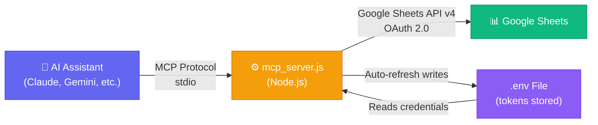
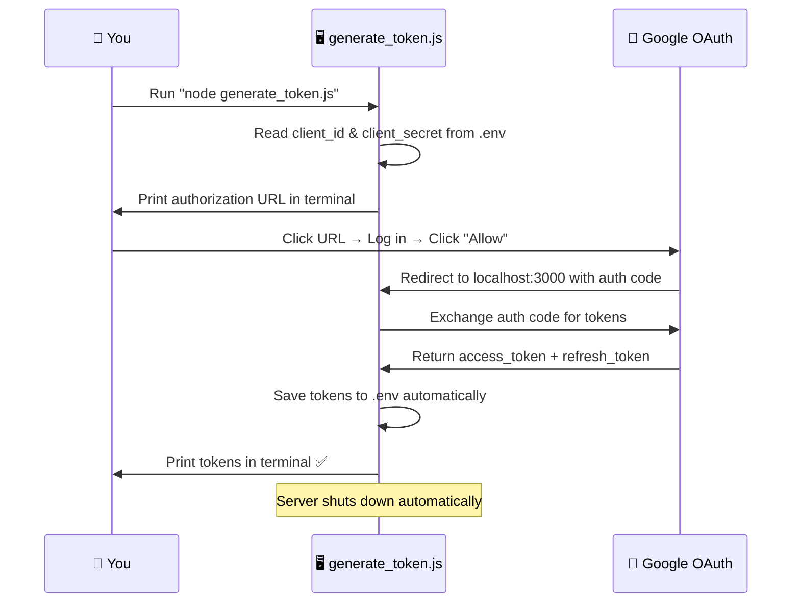
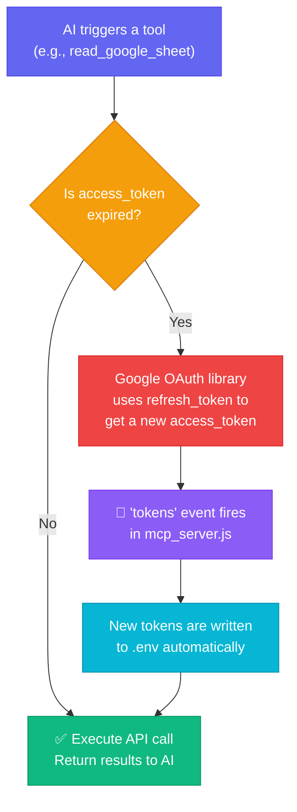
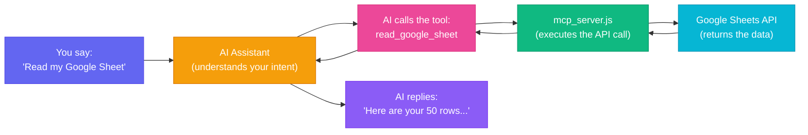
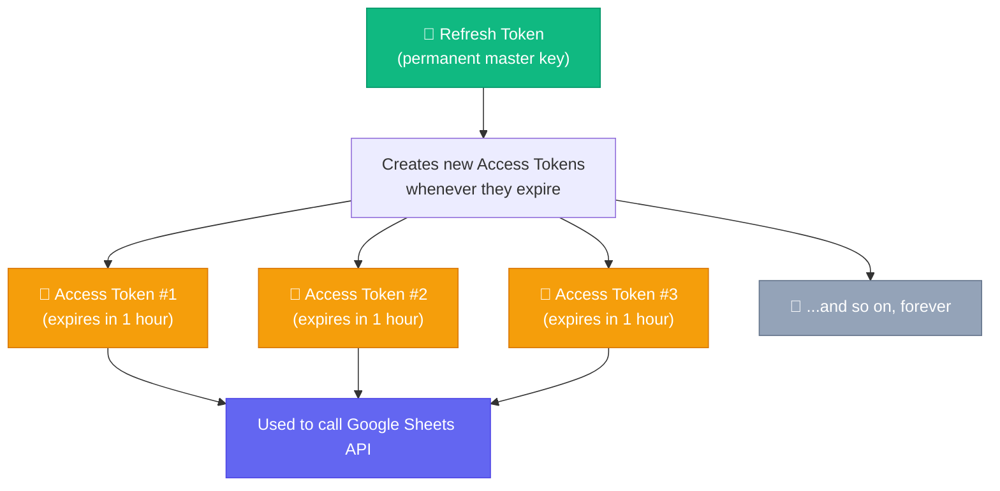
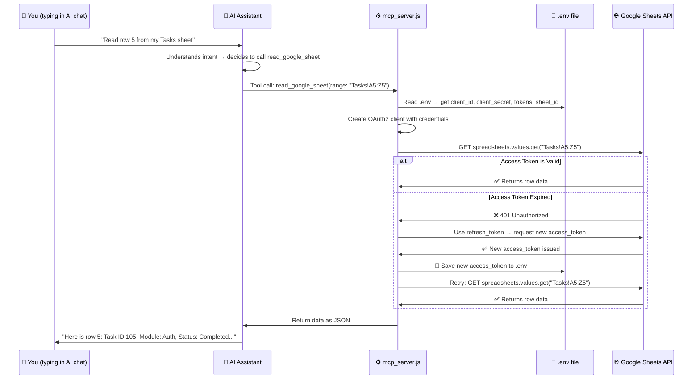
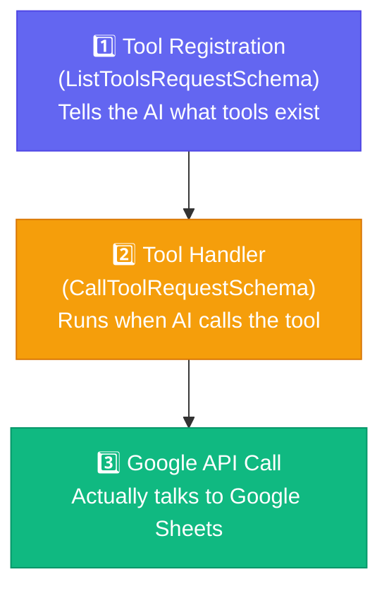

# 📊 Google Sheets MCP Server

A powerful **Model Context Protocol (MCP)** server that connects any AI assistant to Google Sheets. Read, write, format, and manage your spreadsheets using natural language — no manual API calls, no code changes, no token headaches.

> **Built with Node.js** · Uses Google Sheets API v4 · OAuth 2.0 with automatic token refresh

---

## ✨ Features

| Feature | Description |
|---|---|
| 📖 **Read Data** | Read any range of cells from any sheet tab |
| ✏️ **Write Data** | Insert or update rows using A1 notation |
| 🎨 **Format Cells** | Apply font families across any cell range |
| 📋 **Dropdown Validation** | Add data validation dropdowns to columns |
| 🗑️ **Remove Validation** | Remove dropdown rules from columns |
| ➕ **Create Tabs** | Create new sheet tabs inside your spreadsheet |
| 🔄 **Auto Token Refresh** | Access tokens refresh automatically — zero manual work |

---

## 🏛️ Architecture Overview



**How it works:** Your AI assistant communicates with `mcp_server.js` via the MCP protocol over stdio. The server authenticates with Google using OAuth 2.0 credentials from your `.env` file and executes operations on your Google Sheet. When tokens expire, they are refreshed automatically and saved back to `.env`.

---

## 📁 Project Structure

```
MCP_GOOGLE_SHEET/
├── mcp_server.js          # Main MCP server — registers tools & handles requests
├── generate_token.js      # One-time OAuth helper — generates initial tokens
├── .env                   # Your credentials & tokens (never committed to git)
├── .env.example           # Template for new users
├── .gitignore             # Ensures .env stays private
├── package.json           # Node.js dependencies
└── README.md              # This file
```

---

## 🚀 Quick Start

### Prerequisites

- **Node.js** v18 or higher
- A **Google Cloud** account
- A **Google Sheet** you want to control

---

### Step 1: Clone & Install

```bash
git clone https://github.com/Eswarkanakaraj/MCP_GOOGLE_SHEET.git
cd MCP_GOOGLE_SHEET
npm install
```

---

### Step 2: Google Cloud Setup

You need to create OAuth 2.0 credentials in the Google Cloud Console so the server can access your Google Sheets.

#### 2.1 — Create a Google Cloud Project

1. Go to the [Google Cloud Console](https://console.cloud.google.com/).
2. Click **Select a Project** → **New Project**.
3. Name it (e.g., `MCP Sheet Sync`) and click **Create**.

#### 2.2 — Enable the Google Sheets API

1. In your new project, navigate to **APIs & Services → Library**.
2. Search for **Google Sheets API**.
3. Click **Enable**.

#### 2.3 — Configure OAuth Consent Screen

1. Go to **APIs & Services → OAuth Consent Screen**.
2. Select **External** and click **Create**.
3. Fill in the required fields:
   - **App Name**: `MCP Sheet Sync`
   - **User Support Email**: Your email
4. Under **Scopes**, click **Add or Remove Scopes** and add:
   ```
   https://www.googleapis.com/auth/spreadsheets
   ```
5. Under **Test Users**, add your own Google email.
6. Click **Save and Continue**.

> **💡 Important:** If you want tokens that never expire, click **PUBLISH APP** on the OAuth Consent Screen to move from "Testing" to "In Production". In Testing mode, refresh tokens expire after 7 days.

#### 2.4 — Create OAuth Client Credentials

1. Go to **APIs & Services → Credentials**.
2. Click **Create Credentials → OAuth client ID**.
3. Application Type: **Web application**.
4. Name: `MCP Sheet Sync Client`.
5. Under **Authorized redirect URIs**, add:
   ```
   http://localhost:3000/oauth2callback
   ```
6. Click **Create**.
7. Copy your **Client ID** and **Client Secret**.

---

### Step 3: Configure `.env`

Create a `.env` file in the project root with your credentials:

```env
client_id=YOUR_CLIENT_ID.apps.googleusercontent.com
client_secret=YOUR_CLIENT_SECRET
sheet_id=YOUR_GOOGLE_SHEET_ID
```

> **💡 How to find your Sheet ID:** Open your Google Sheet in the browser. The URL looks like:
> `https://docs.google.com/spreadsheets/d/`**`1gCZhHSR-WcofTcaf9nbNYLURRmuEGXnj4BzDulHjWAs`**`/edit`
> The bold part is your `sheet_id`.
---

### Step 4: Generate Your Tokens (One-Time Setup)

Run the token generator script:

```bash
node generate_token.js
```

**What happens:**



1. The script prints a URL in your terminal.
2. Click the URL (or copy-paste into your browser).
3. Log in with your Google account and click **"Allow"**.
4. The script automatically catches the callback, fetches your tokens, saves them to `.env`, and prints them in the console.
5. **Done!** You never need to run this script again (unless you revoke access).

After running, your `.env` will look like this:

```env
client_id=452139...apps.googleusercontent.com
client_secret=GOCSPX-...
sheet_id=1gCZhHSR-...
refresh_token=1//0gzqB9...
access_token=ya29.a0AQvPy...
```

---

### Step 5: Register the MCP Server

Add the server to your AI assistant's MCP configuration file.

#### For Claude Desktop

Edit `claude_desktop_config.json`:

```json
{
  "mcpServers": {
    "GoogleSheetsSync": {
      "command": "node",
      "args": [
        "C:/path/to/MCP_GOOGLE_SHEET/mcp_server.js"
      ]
    }
  }
}
```

#### For Gemini / Antigravity IDE

Edit `mcp_config.json`:

```json
{
  "mcpServers": {
    "GoogleSheetsSync": {
      "command": "node",
      "args": [
        "D:/path/to/MCP_GOOGLE_SHEET/mcp_server.js"
      ]
    }
  }
}
```

> **📌 Note:** Replace the path with the actual absolute path to `mcp_server.js` on your machine.

---

## 🔄 How Automatic Token Refresh Works

This is the key feature that makes this server zero-maintenance after the initial setup.



### What this means for you:

| Scenario | What happens | Action required |
|---|---|---|
| Access token expires (every ~1 hour) | Server silently refreshes it using `refresh_token` and saves the new token to `.env` | **None** ✅ |
| Refresh token is valid | Google issues a new access token whenever needed | **None** ✅ |
| App is published in Google Cloud | Refresh token **never expires** | **None** ✅ |
| App is in Testing mode | Refresh token expires after 7 days | Re-run `node generate_token.js` |
| You revoke access from Google Account | All tokens become invalid | Re-run `node generate_token.js` |

---

## 🧰 Available MCP Tools (22 Total)

The server exposes 22 powerful tools to interact with Google Sheets and Google Drive. If `spreadsheet_id` is omitted in any tool, the server automatically falls back to the default `sheet_id` configured in your `.env`.

---

### 📂 1. Spreadsheet & Drive Management

#### `list_spreadsheets`
Lists Google Spreadsheets accessible by your account, optionally inside a specific folder.
* **Parameters:**
  * `folder_id` *(string, optional)*: Google Drive folder ID to search in.
* **Example prompt:** `"List all spreadsheets in my Drive folder '1A2b3C...'"`

#### `create_spreadsheet`
Creates a brand new Google Spreadsheet, optionally placing it inside a specific Drive folder.
* **Parameters:**
  * `title` *(string, required)*: The title of the spreadsheet (e.g. `'Quarterly Report'`).
  * `folder_id` *(string, optional)*: Google Drive folder ID to place the spreadsheet in.
* **Example prompt:** `"Create a new spreadsheet called 'Marketing Q3' inside folder '1aBcDe...'"`

#### `share_spreadsheet`
Shares a spreadsheet with specific Google accounts and assigns permissions.
* **Parameters:**
  * `spreadsheet_id` *(string, optional)*: Target spreadsheet ID.
  * `recipients` *(array of objects, required)*: List of `[{ "email_address": "user@example.com", "role": "writer" }]` (roles: `reader`, `commenter`, `writer`).
  * `send_notification` *(boolean, optional, default: true)*: Whether to email the recipients.
* **Example prompt:** `"Share this spreadsheet with john@example.com as a writer and jane@example.com as a reader."`

---

### 🗂️ 2. Sheet / Tab Operations

#### `list_sheets`
Lists the titles of all sheet tabs inside a spreadsheet.
* **Parameters:**
  * `spreadsheet_id` *(string, optional)*: Target spreadsheet ID.
* **Example prompt:** `"What are the tab names in my current spreadsheet?"`

#### `create_sheet`
Creates a new sheet tab in a spreadsheet.
* **Parameters:**
  * `spreadsheet_id` *(string, optional)*: Target spreadsheet ID.
  * `title` *(string, required)*: Name of the new tab.
* **Example prompt:** `"Add a new tab called 'Invoices' to the spreadsheet."`

#### `rename_sheet`
Renames an existing sheet tab.
* **Parameters:**
  * `spreadsheet` *(string, optional)*: Target spreadsheet ID.
  * `sheet` *(string, required)*: Current tab name (e.g. `'Sheet1'`).
  * `new_name` *(string, required)*: New tab name (e.g. `'Dashboard'`).
* **Example prompt:** `"Rename the tab 'Sheet1' to 'Active Users'."`

#### `copy_sheet`
Duplicates a sheet tab from a source spreadsheet to a destination spreadsheet, optionally renaming it.
* **Parameters:**
  * `src_spreadsheet` *(string, optional)*: Source spreadsheet ID.
  * `src_sheet` *(string, required)*: Source tab name.
  * `dst_spreadsheet` *(string, required)*: Destination spreadsheet ID.
  * `dst_sheet` *(string, optional)*: Desired name in the destination spreadsheet.
* **Example prompt:** `"Copy the 'Templates' tab from this sheet into spreadsheet '1zXyW...' and rename it 'June Form'."`

#### `create_sheet_tab` *(Backward Compatibility)*
Creates a new sheet tab inside the default spreadsheet.
* **Parameters:**
  * `title` *(string, required)*: Name of the new tab.

---

### 📖 3. Reading Data

#### `get_sheet_data`
Reads cell values from a sheet tab. Can optionally fetch full styling, metadata, and formulas.
* **Parameters:**
  * `spreadsheet_id` *(string, optional)*: Target spreadsheet ID.
  * `sheet` *(string, required)*: Name of the tab (e.g. `'Sheet1'`).
  * `range` *(string, optional)*: A1 notation range (e.g. `'A1:C50'`). If omitted, reads the entire tab.
  * `include_grid_data` *(boolean, optional, default: false)*: If true, returns detailed cell metadata, formulas, and formatting.
* **Example prompt:** `"Fetch all columns A to D from the 'Users' tab, including formatting."`

#### `get_sheet_formulas`
Reads only the underlying formulas in a range.
* **Parameters:**
  * `spreadsheet_id` *(string, optional)*: Target spreadsheet ID.
  * `sheet` *(string, required)*: Tab name.
  * `range` *(string, optional)*: A1 range. If omitted, reads all formulas in the tab.
* **Example prompt:** `"Show me the formulas used in column F of sheet 'Financials'."`

#### `get_multiple_sheet_data`
Fetches cell values from multiple different ranges/tabs/spreadsheets in a single request.
* **Parameters:**
  * `queries` *(array of objects, required)*: List of `[{ "spreadsheet_id": "optional", "sheet": "Sheet1", "range": "A1:B2" }]`.
* **Example prompt:** `"Read range A1:B10 in 'Sheet1' and range D5:E10 in 'Sheet2' at the same time."`

#### `get_multiple_spreadsheet_summary`
Fetches titles, tab names, headers, and the first few rows of multiple spreadsheets in a single call (great for high-level folder audits).
* **Parameters:**
  * `spreadsheet_ids` *(array of strings, required)*: List of spreadsheet IDs.
  * `rows_to_fetch` *(integer, optional, default: 5)*: Number of rows to fetch as preview.
* **Example prompt:** `"Summarize the spreadsheets '1aBc...', '1dEf...', and '1gHi...'."`

#### `read_google_sheet` *(Backward Compatibility)*
Reads range values from the default configured spreadsheet.
* **Parameters:**
  * `range` *(string, required)*: A1 notation range.

---

### ✍️ 4. Writing & Formatting Data

#### `update_cells`
Writes a 2D array of values directly to a specific range (overwrites existing values).
* **Parameters:**
  * `spreadsheet_id` *(string, optional)*: Target spreadsheet ID.
  * `sheet` *(string, required)*: Tab name.
  * `range` *(string, required)*: A1 range (e.g. `'A1:B2'`).
  * `data` *(2D array, required)*: Array of arrays (e.g. `[[1, 2], [3, 4]]`).
* **Example prompt:** `"Put the numbers 10, 20 in Row 2, columns A and B of tab 'Metrics'."`

#### `batch_update_cells`
Writes values to multiple non-contiguous ranges/tabs in a single API call.
* **Parameters:**
  * `spreadsheet_id` *(string, optional)*: Target spreadsheet ID.
  * `sheet` *(string, required)*: Tab name.
  * `ranges` *(object, required)*: Dictionary mapping A1 ranges to 2D arrays (e.g. `{ "A1:B2": [[1,2],[3,4]], "D5": [["Hello"]] }`).
* **Example prompt:** `"Write 'John' to A1, 'Doe' to B1, and 'Manager' to E5 in the 'Staff' sheet."`

#### `update_google_sheet` *(Backward Compatibility)*
Appends/updates a single row of values inside the default spreadsheet.
* **Parameters:**
  * `range` *(string, required)*: A1 range.
  * `values` *(string[])*: Array of string values.

#### `format_google_sheet` *(Backward Compatibility)*
Sets font family (e.g. `'Inter'`) for a range of cells in the default spreadsheet.
* **Parameters:**
  * `fontFamily` *(string, required)*: Font name.
  * `sheetId` *(integer)*, `startRowIndex` *(integer)*, `endRowIndex` *(integer)*, `startColumnIndex` *(integer)*, `endColumnIndex` *(integer)*.

---

### 📊 5. Row & Column Management

#### `add_rows`
Inserts empty rows at a specific index.
* **Parameters:**
  * `spreadsheet_id` *(string, optional)*: Target spreadsheet ID.
  * `sheet` *(string, required)*: Tab name.
  * `count` *(integer, required)*: Number of empty rows to insert.
  * `start_row` *(integer, optional, default: 0)*: 0-based row index to start inserting.
* **Example prompt:** `"Insert 10 empty rows starting at row 5 in sheet 'Logs'."`

#### `add_columns`
Inserts empty columns at a specific index.
* **Parameters:**
  * `spreadsheet_id` *(string, optional)*: Target spreadsheet ID.
  * `sheet` *(string, required)*: Tab name.
  * `count` *(integer, required)*: Number of empty columns to insert.
  * `start_column` *(integer, optional, default: 0)*: 0-based column index to start inserting.
* **Example prompt:** `"Insert 3 empty columns starting at column D (index 3) in sheet 'Report'."`

---

### 🚦 6. Data Validation

#### `add_dropdown_validation` *(Backward Compatibility)*
Applies data validation dropdown list constraints to a column range.
* **Parameters:**
  * `columnIndex` *(integer, required)*: 0-based column index.
  * `options` *(string[], required)*: List of options.
  * `sheetId` *(integer)*, `startRowIndex` *(integer)*, `endRowIndex` *(integer)*.
* **Example prompt:** `"Make a dropdown in Column C with options: 'Paid', 'Unpaid'."`

#### `remove_dropdown_validation` *(Backward Compatibility)*
Clears dropdown rules from a column.
* **Parameters:**
  * `columnIndex` *(integer, required)*: 0-based column index.
  * `sheetId` *(integer)*, `startRowIndex` *(integer)*, `endRowIndex` *(integer)*.

---

### 📈 7. Visualizations

#### `add_chart`
Creates and embeds a beautiful chart (column, bar, line, pie, etc.) directly into a spreadsheet tab.
* **Parameters:**
  * `spreadsheet_id` *(string, optional)*: Target spreadsheet ID.
  * `sheet` *(string, required)*: Name of the sheet containing data.
  * `chart_type` *(string, required)*: Chart type (`COLUMN`, `BAR`, `LINE`, `AREA`, `PIE`, `SCATTER`, `COMBO`, `HISTOGRAM`).
  * `data_range` *(string, required)*: A1 range (e.g. `'A1:C10'`). The first row is treated as headers, first column as categories (X-axis).
  * `title` *(string, optional)*: Chart title.
  * `x_axis_label` *(string, optional)*: X-axis title.
  * `y_axis_label` *(string, optional)*: Y-axis title.
  * `position_x` / `position_y` *(integer, optional)*: Placement offsets.
  * `width` / `height` *(integer, optional)*: Chart dimensions.
* **Example prompt:** `"Create a COLUMN chart in 'Sales' using data from A1:B12. Title it '2026 Monthly Revenue', label X-axis as 'Months' and Y-axis as 'Earnings'."`

---

## 🧠 How It Actually Works (For Beginners)

If you are completely new to MCP, OAuth, or APIs — this section will explain everything from scratch.

### What is MCP?

**MCP (Model Context Protocol)** is a standard that lets AI assistants (like Claude, Gemini, etc.) call external tools. Think of it like giving your AI a set of superpowers:



Without MCP, the AI can only chat with you. With MCP, the AI can **do things** — like reading your spreadsheet, updating cells, or creating tabs.

### What is OAuth 2.0?

Google doesn't allow random apps to access your spreadsheets. You need **permission**. OAuth 2.0 is Google's permission system:

| Concept | Real-World Analogy |
|---|---|
| **Client ID** | Your app's ID card — tells Google "who is asking" |
| **Client Secret** | Your app's password — proves it's really your app |
| **Access Token** | A temporary visitor pass — expires every ~1 hour |
| **Refresh Token** | A permanent master key — used to get new visitor passes forever |

### Why Do We Need Two Tokens?



Google intentionally makes access tokens expire quickly for security. If someone steals your access token, it only works for 1 hour. But your refresh token can silently generate new access tokens forever — and our server does this **automatically**.

### What Happens Inside `mcp_server.js`?

Here is the complete lifecycle of a single request:



### What Does Each File Do?

| File | Purpose | When does it run? |
|---|---|---|
| `mcp_server.js` | The main server. Registers 6 tools, handles every AI request, talks to Google, auto-refreshes tokens | Every time the AI uses a tool (runs continuously in the background) |
| `generate_token.js` | Helper script. Opens a local web server, redirects you to Google login, catches the callback, saves tokens | **Only once** during initial setup (or if you revoke access) |
| `.env` | Stores your credentials and tokens | Read by both scripts. Updated automatically when tokens refresh |
| `.env.example` | Template showing what keys are needed | Never runs — just a reference for new users |

---

## 🔧 Customization Guide

The 6 tools included in this project are designed for a specific use case (task tracking with dropdowns). But **you can easily add your own tools** or modify existing ones.

### Understanding the Tool Structure

Every tool in `mcp_server.js` has exactly 3 parts:



### Example: Adding a New Tool — `delete_rows`

Let's say you want a tool that **deletes rows** from your sheet. Here is exactly how to do it:

**Step 1 — Register the tool** (inside the `ListToolsRequestSchema` handler, add to the `tools` array):

```javascript
{
  name: "delete_rows",
  description: "Deletes a range of rows from a Google Sheet tab.",
  inputSchema: {
    type: "object",
    properties: {
      sheetId: {
        type: "integer",
        description: "The sheet tab ID. Default is 0 (first tab)."
      },
      startRowIndex: {
        type: "integer",
        description: "The starting row index (0-based). e.g., 4 means Row 5."
      },
      endRowIndex: {
        type: "integer",
        description: "The ending row index (exclusive). e.g., 7 deletes up to Row 7."
      }
    },
    required: ["startRowIndex", "endRowIndex"]
  }
}
```

**Step 2 — Add the handler** (inside the `CallToolRequestSchema` handler):

```javascript
if (request.params.name === "delete_rows") {
  const sheetId = request.params.arguments.sheetId || 0;
  const startRowIndex = request.params.arguments.startRowIndex;
  const endRowIndex = request.params.arguments.endRowIndex;

  const requests = [
    {
      deleteDimension: {
        range: {
          sheetId: sheetId,
          dimension: "ROWS",
          startIndex: startRowIndex,
          endIndex: endRowIndex,
        },
      },
    },
  ];

  const result = await sheets.spreadsheets.batchUpdate({
    spreadsheetId: SPREADSHEET_ID,
    resource: { requests },
  });

  return {
    content: [
      {
        type: "text",
        text: `Success! Rows ${startRowIndex} to ${endRowIndex} deleted.`,
      },
    ],
  };
}
```

**Step 3 — Add the tool name to the request filter** (the `if` block at the top of `CallToolRequestSchema`):

```javascript
request.params.name === "delete_rows" ||
```

**That's it!** Restart your AI assistant and you can now say: *"Delete rows 10 to 15 from my Tasks sheet."*

### Example: Adding a New Tool — `append_row`

If you want a tool that automatically appends data to the **next empty row** (instead of specifying a range):

```javascript
// Registration:
{
  name: "append_row",
  description: "Appends a new row of data to the end of a sheet.",
  inputSchema: {
    type: "object",
    properties: {
      sheetName: {
        type: "string",
        description: "The sheet tab name. e.g., 'Sheet1'"
      },
      values: {
        type: "array",
        items: { type: "string" },
        description: "Array of values to append as a new row."
      }
    },
    required: ["sheetName", "values"]
  }
}

// Handler:
if (request.params.name === "append_row") {
  const sheetName = request.params.arguments.sheetName;
  const values = request.params.arguments.values;

  const result = await sheets.spreadsheets.values.append({
    spreadsheetId: SPREADSHEET_ID,
    range: `${sheetName}!A1`,
    valueInputOption: "USER_ENTERED",
    insertDataOption: "INSERT_ROWS",
    resource: { values: [values] },
  });

  return {
    content: [
      {
        type: "text",
        text: `Success! Row appended to ${sheetName}.`,
      },
    ],
  };
}
```

### More Tool Ideas You Can Build

| Tool Idea | Google Sheets API Method | Description |
|---|---|---|
| `bold_cells` | `batchUpdate` → `repeatCell` | Make text bold in a range |
| `set_background_color` | `batchUpdate` → `repeatCell` | Change cell background color |
| `merge_cells` | `batchUpdate` → `mergeCells` | Merge a range of cells |
| `auto_resize_columns` | `batchUpdate` → `autoResizeDimensions` | Auto-fit column widths |
| `protect_range` | `batchUpdate` → `addProtectedRange` | Lock cells from editing |
| `get_sheet_metadata` | `spreadsheets.get` | Get all tab names and IDs |
| `duplicate_sheet_tab` | `batchUpdate` → `duplicateSheet` | Clone a tab |
| `sort_range` | `batchUpdate` → `sortRange` | Sort rows by a column |
| `clear_range` | `spreadsheets.values.clear` | Clear all data in a range |
| `find_and_replace` | `batchUpdate` → `findReplace` | Search and replace text |

> **📖 Reference:** All available operations are documented in the [Google Sheets API Reference](https://developers.google.com/sheets/api/reference/rest).

### Changing the Google API Scope

If you want to extend this server beyond Google Sheets (e.g., Google Drive, Google Calendar), you need to:

1. **Enable the additional API** in Google Cloud Console (APIs & Services → Library).
2. **Update the scope** in `generate_token.js` (line 34):
   ```javascript
   // Current (Sheets only):
   scope: ['https://www.googleapis.com/auth/spreadsheets'],

   // Extended (Sheets + Drive):
   scope: [
     'https://www.googleapis.com/auth/spreadsheets',
     'https://www.googleapis.com/auth/drive',
   ],
   ```
3. **Re-run** `node generate_token.js` to get a new token with the expanded permissions.
4. **Add new tool handlers** in `mcp_server.js` using the relevant Google API client (e.g., `google.drive({ version: 'v3', auth: oAuth2Client })`).

---

## 📐 Schema Flexibility

The MCP server is **schema-agnostic** — it does not enforce any specific column layout. This means:

- ✅ You can add, remove, or reorder columns without changing `mcp_server.js`
- ✅ You can have any number of sheet tabs
- ✅ You can use any column as a dropdown
- ✅ Just describe your sheet layout to the AI in your prompt and it adapts

---

## 💡 Prompt Engineering Tips

### 1. Describe Your Layout Once

Give the AI your column mapping so it knows where to write:

> *"My sheet has: Column A = Task ID, Column B = Module, Column C = Description, Column D = Status (dropdown: 'Not Started', 'In Progress', 'Completed'), Column E = Date. Data starts on Row 3."*

### 2. Bulk Insert

> *"Add these 5 tasks starting from the next empty row:*
> *1. Design login page*
> *2. Create user database*
> *3. Set up email templates*
> *4. Write API validation*
> *5. Build logout flow*
> *Mark all as 'Not Started' and use today's date."*

### 3. Format & Style

> *"Format the entire 'Tasks' sheet with font 'Inter'. Then add dropdown validation to Column D with ['Not Started', 'In Progress', 'Completed'] and Column E with ['Pending', 'Verified'] starting from Row 3."*

### 4. Read & Analyze

> *"Read all data from the Tasks sheet and tell me how many tasks are marked as 'Completed'."*

---


> *"Important thing is i use only 10 tools you can add more tools if you want to."*

---

## 🔒 Security

- 🔐 Your `.env` file containing all secrets is listed in `.gitignore` — it is **never** pushed to GitHub
- 🔑 OAuth tokens are stored locally on your machine only
- 🛡️ The server runs locally via stdio — no external network ports are exposed during normal MCP operation
- ♻️ Access tokens expire every hour and are refreshed automatically

---

## 🐛 Troubleshooting

| Problem | Solution |
|---|---|
| `Missing refresh_token or access_token in .env` | Run `node generate_token.js` to generate tokens |
| `Error: invalid_grant` | Your refresh token expired. Re-run `node generate_token.js` |
| `Error: Token has been expired or revoked` | Re-run `node generate_token.js`. Consider publishing your app in Google Cloud to prevent expiry |
| Tokens keep expiring every 7 days | Your Google Cloud app is in "Testing" mode. Go to OAuth Consent Screen → click **PUBLISH APP** |
| `Port 3000 already in use` | Another process is using port 3000. Kill it with `npx kill-port 3000` or close the other terminal |
| MCP server not showing in AI assistant | Double-check the path in `mcp_config.json` and restart your AI assistant |

---

## 📄 License

MIT License — feel free to use, modify, and distribute.

---

## 🤝 Contributing

Contributions make the open-source community an amazing place to learn, inspire, and create. Any contributions you make are **greatly appreciated**! 

To contribute to this project, follow the standard **Fork & Pull Request** workflow:

### 1. Fork the Project
Click the **Fork** button at the top-right of this page to create a copy of this repository under your own GitHub account.

### 2. Clone Your Fork
Clone your forked repository to your local machine:
```bash
git clone https://github.com/YOUR_USERNAME/MCP_GOOGLE_SHEET.git
cd MCP_GOOGLE_SHEET
```

### 3. Create a Feature Branch
Create a new branch for your feature or bug fix:
```bash
git checkout -b feature/AmazingFeature
```

### 4. Make Changes & Commit
Implement your feature, write tests if applicable, and commit your changes:
```bash
git commit -m "Add some AmazingFeature"
```

### 5. Push to Your Fork
Push your new branch to your own GitHub repository:
```bash
git push origin feature/AmazingFeature
```

### 6. Open a Pull Request (PR)
Go to the original `Eswarkanakaraj/MCP_GOOGLE_SHEET` repository on GitHub. You will see a banner prompting you to compare and open a **Pull Request**. Submit the PR detailing your changes!

We will review your code, run tests, and merge your contribution as soon as possible! 🚀

---

<p align="center">
  Built with ❤️ by <a href="https://github.com/Eswarkanakaraj">Eswarkanakaraj</a>
</p>